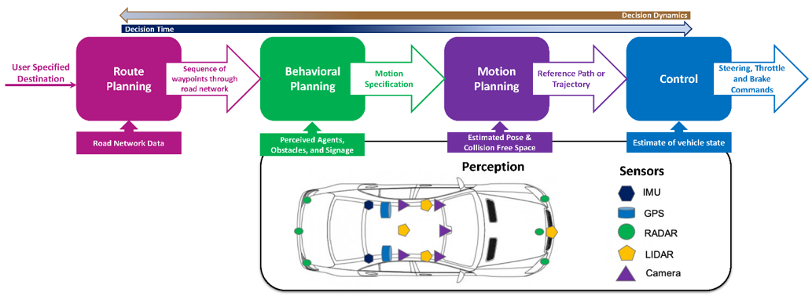
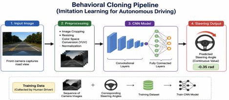
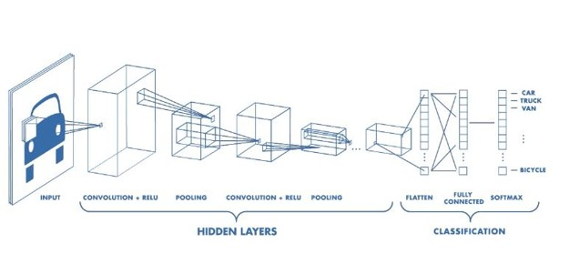
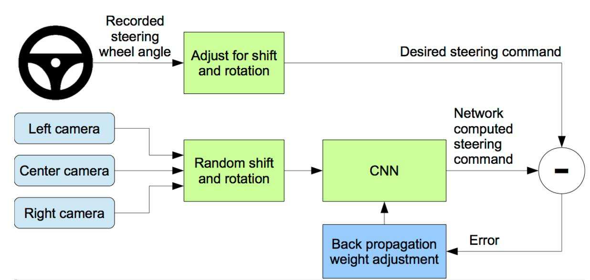
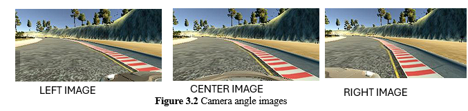
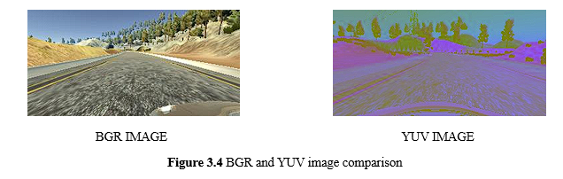
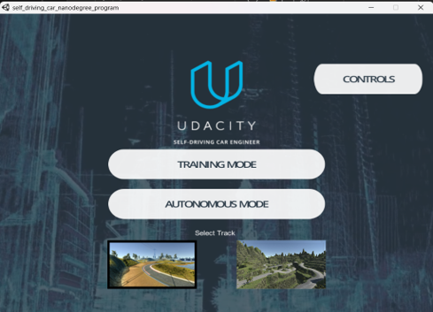

# 🚗 AI-Based Self-Driving Car Simulator for Steering Angle Prediction Using Computer Vision and Deep Learning


---

## 📌 Project Overview

Autonomous driving is one of the most transformative applications of Artificial Intelligence and Computer Vision. Traditional self-driving systems often rely on multiple independent modules for lane detection, path planning, and vehicle control. This project explores an **end-to-end deep learning approach** that learns driving behavior directly from camera images.

Using **Behavioral Cloning** and NVIDIA's CNN architecture, the model learns steering behavior from human driving demonstrations collected in the Udacity Self-Driving Car Simulator. The trained network predicts steering angles in real time, enabling autonomous vehicle navigation within the simulator environment.

This project was developed as a **Major Project** for the Bachelor of Technology program in **Electrical and Computer Engineering** at **Manipal University Jaipur**.

---

## 🎯 Project Objectives

* Develop an end-to-end autonomous driving system using deep learning.
* Predict steering angles directly from road images.
* Implement Behavioral Cloning using human driving data.
* Train and evaluate a CNN-based steering prediction model.
* Deploy the trained model for real-time autonomous navigation.
* Demonstrate practical applications of AI in intelligent transportation systems.

---

## 🚀 Key Highlights

✅ End-to-End Behavioral Cloning System

✅ NVIDIA CNN-Based Steering Prediction

✅ Real-Time Autonomous Driving

✅ TensorFlow & Keras Implementation

✅ Dataset Balancing and Augmentation

✅ Multi-Track Training Strategy

✅ Steering Smoothing and Dynamic Throttle Control

✅ Flask + Socket.IO Real-Time Deployment

---

# 🏗️ System Design & Architecture

## Autonomous Driving System Architecture

The autonomous driving pipeline consists of perception, learning, and vehicle control modules working together to enable autonomous navigation.



---

## Behavioral Cloning

Behavioral Cloning enables the model to learn driving behavior directly from human demonstrations without manually programmed driving rules.



---

## CNN Model Architecture

The steering angle prediction model is based on NVIDIA's Behavioral Cloning CNN architecture.



### Architecture Components

* Input Normalization Layer
* 5 Convolutional Layers
* ReLU Activation Functions
* Dropout Regularization
* Fully Connected Dense Layers
* Single Steering Angle Output Node

---

## Data Preprocessing Pipeline

All captured images undergo preprocessing before being supplied to the neural network.



### Processing Steps

* Image Resizing
* YUV Color Space Conversion
* Pixel Normalization
* Dataset Balancing
* Data Augmentation

---

## Camera Configuration

The simulator provides images from multiple camera viewpoints that help improve recovery behavior during training.



---

## BGR to YUV Conversion

Images are converted from BGR to YUV color space to improve learning efficiency and robustness under varying lighting conditions.



---

## Udacity Self-Driving Car Simulator

The Udacity simulator was used for dataset collection, training validation, and autonomous driving evaluation.



---

# 📂 Dataset

The dataset was collected by manually driving the vehicle inside the Udacity Self-Driving Car Simulator.

### Dataset Characteristics

| Attribute     | Value                              |
| ------------- | ---------------------------------- |
| Simulator     | Udacity Self-Driving Car Simulator |
| Tracks        | Track 1 & Track 2                  |
| Camera Inputs | Center, Left, Right                |
| Total Samples | 12,722                             |
| Task          | Steering Angle Prediction          |

### Dataset Enhancement Techniques

* Dataset Balancing
* Horizontal Image Flipping
* Recovery Driving Data Collection
* Multi-Track Training

These techniques significantly improved model generalization and autonomous driving performance.

---

# 🛠️ Technology Stack

### Programming Language

* Python

### Deep Learning

* TensorFlow
* Keras

### Computer Vision

* OpenCV
* NumPy
* Pandas

### Deployment

* Flask
* Socket.IO
* Eventlet

### Visualization

* Matplotlib

---

# ⚙️ Training Configuration

| Parameter        | Value                    |
| ---------------- | ------------------------ |
| Model            | NVIDIA CNN               |
| Optimizer        | Adam                     |
| Learning Rate    | 0.0001                   |
| Loss Function    | Mean Squared Error (MSE) |
| Batch Size       | 32                       |
| Epochs           | 25                       |
| Input Resolution | 66 × 200 × 3             |

---

# 🔄 Project Workflow

```text
Driving Data Collection
          │
          ▼
Dataset Cleaning & Balancing
          │
          ▼
Data Augmentation
          │
          ▼
Image Preprocessing
          │
          ▼
CNN Model Training
          │
          ▼
Model Validation
          │
          ▼
Real-Time Inference
          │
          ▼
Autonomous Driving
```

---

# 📊 Experimental Results

## Training Loss Curve

The model demonstrates stable convergence during training with decreasing training and validation loss.


---

## Overfitting Analysis

The figure below illustrates model behavior and highlights the importance of augmentation and dropout regularization techniques.


---

## Implementation Pipeline

Complete implementation pipeline used during training and deployment.


---

## Autonomous Driving Performance

The trained CNN model successfully navigated the simulator environment using only camera input and steering angle predictions.


---

# 💡 Key Engineering Challenges

### Dataset Imbalance

A large percentage of collected samples represented straight driving. Dataset balancing was performed to improve turning performance.

### Recovery Behavior

Additional recovery-driving data was collected to teach the model how to safely return to the center of the lane.

### Lighting Variations

YUV color conversion improved robustness under varying illumination conditions.

### Overfitting

Dropout regularization and augmentation techniques were applied to improve model generalization.

---

# 📈 Key Outcomes

* Successfully implemented an end-to-end autonomous driving pipeline.
* Achieved stable lane-following behavior in the simulator.
* Demonstrated effective steering angle prediction using CNNs.
* Improved driving performance using balancing and augmentation techniques.
* Successfully deployed the trained model for real-time autonomous navigation.

---

# 📁 Repository Structure

```text
AI-Self-Driving-Car-Steering-Angle-Prediction/
│
├── README.md
├── LICENSE
├── requirements.txt
│
├── src/
│   ├── train.py
│   ├── drive.py
│   └── README.md
│
├── results/
│   ├── README.md
│   ├── Autonomous Driving.png
│   ├── Implementation Pipeline.png
│   ├── MSE vs EPOCH curve.png
│   └── MSE vs Epoch curve demonstrating overfitting.png
│
└── system-design/
    ├── autonomous-driving-system-architecture.png
    ├── behavioral-cloning.png
    ├── cnn-model-architecture.jpg
    ├── camera-angles.png
    ├── data-preprocessing-pipeline.png
    ├── bgr-yuv-conversion.png
    └── udacity-simulator.png
```

---

# 🔮 Future Scope

Potential future enhancements include:

* Traffic Sign Recognition
* Lane Detection Integration
* Object Detection Integration
* Obstacle Avoidance Systems
* Reinforcement Learning-Based Driving Agents
* Sensor Fusion Techniques
* Edge AI Deployment
* Real-World Vehicle Implementation

---
# 📚 References

1. Mariusz Bojarski et al., *End to End Learning for Self-Driving Cars*, NVIDIA Research, 2016.

2. Udacity Self-Driving Car Simulator:
   https://github.com/udacity/self-driving-car-sim

3. TensorFlow Documentation:
   https://www.tensorflow.org/

4. Keras Documentation:
   https://keras.io/

5. OpenCV Documentation:
   https://opencv.org/

6. Behavioral Cloning Project (Udacity Self-Driving Car Engineer Nanodegree).

---

# 👨‍💻 Author

**Naman Bhasin**

B.Tech. Electrical and Computer Engineering
Manipal University Jaipur

---

# 📜 License

This project is licensed under the MIT License.
